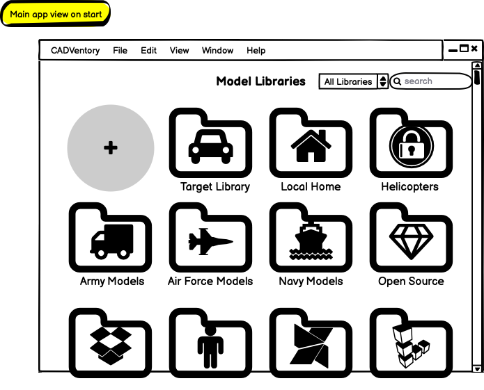
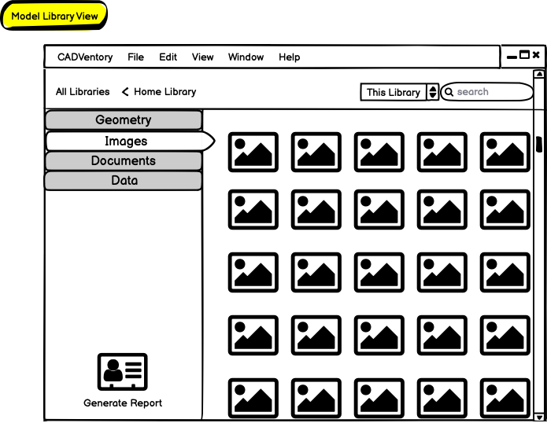

# CADventory

CADventory is a Qt desktop application for indexing and organizing large CAD model libraries and their associated files without requiring a heavyweight PDM deployment.

It is aimed at BRL-CAD-centric and analysis-oriented workflows where individuals and teams need to work against existing filesystem-based repositories, preserve local or offline deployment options, and build useful metadata, reporting, and discovery layers on top of those repositories.

## Project Status

CADventory is currently in a prototype-to-MVP transition.

- Product and architecture overview: [doc/CADventory.docx](doc/CADventory.docx)
- AI-assisted tagging is experimental and is still being hardened

## Wireframes

These are early CADventory wireframes from the design package, included to give the repository a project-specific visual overview while the implementation continues to evolve.




## What CADventory Is Trying To Do

- index existing CAD model repositories in place instead of requiring a new enterprise PDM stack
- track model metadata, tags, related files, and reportable inventory information
- support desktop deployment patterns that fit constrained, offline, or policy-limited environments
- provide a practical discovery and reporting layer for large geometry and associated-data collections

## Build Requirements

- CMake 3.25 or newer
- C++17 compiler
- Qt 6
- SQLite
  The project can use bundled SQLite by default, or a system SQLite configuration
- BRL-CAD, with `BRLCAD_ROOT` pointing to a built or installed tree

Important:

- CADventory currently expects `find_package(BRLCAD)` to resolve BRL-CAD libraries
- CADventory also checks for `mged`, `rt`, and `gist` under `${BRLCAD_ROOT}/bin`
- if the BRL-CAD tree exports a Qt package under `lib/cmake/Qt6`, CADventory uses
  it automatically so BRL-CAD plugins and CADventory load the same Qt runtime
- otherwise, set `Qt6_DIR` to the Qt installation used to build BRL-CAD

## Build

```bash
cmake -S . -B build-release \
  -DCMAKE_BUILD_TYPE=Release \
  -DBRLCAD_ROOT=/path/to/brlcad/install-or-build-root

cmake --build build-release
cmake --install build-release --prefix ./install
```

Notes:

- `CADVENTORY_WITH_GUI=ON` is the default, i.e., GUI mode is the default.
- if you want a headless-only build, configure with `-DCADVENTORY_WITH_GUI=OFF`
- if you are using a multi-config generator on Windows, add `--config Release` to build and install commands

## Running

After install, the executable is typically:

- macOS/Linux: `./install/bin/cadventory`
- Windows: `.\install\bin\cadventory.exe`

The currently supported command-line options are:

- `--index /path/to/library`
  Run library indexing in CLI mode
- `--worker /path/to/library`
  Run the background worker in CLI mode
- `--report /path/to/library`
  Recursively discover and process BRL-CAD `.g` files, render geometry previews,
  and assemble a PDF without opening the GUI. Report metadata and renderer
  scratch files use a temporary workspace, so existing library metadata is not
  reset or modified.
- `-o`, `--output /path/to/report.pdf`
  Set the output path for `--report`
- `--depth N`
  Set the initial report scan depth; the scan automatically deepens when needed
- `--no-tags`
  Skip optional AI tagging during report generation
- `--reset`
  Clear CADventory settings and reset the model database state
- `-j`, `--num-cpus`
  Set the worker thread count
- `-t`, `--timeout`
  Set the worker timeout value in seconds
- `-v`
  Increase logging verbosity. The logger also supports stacked flags such as `-vv`

Example:

```bash
./install/bin/cadventory --index /path/to/library -v
```

Generate a folder inventory PDF:

```bash
./install/bin/cadventory \
  --report /path/to/library \
  --output /path/to/model-inventory.pdf \
  --no-tags
```

## AI Tagging

CADventory includes an experimental AI-assisted tagging path built around Ollama and a local model such as `llama3`.

Configuration:

- In `Settings`, optionally set the path to the Ollama executable; leave it blank to discover `ollama` from `PATH`.
- Select an installed local model (the default is `llama3`).
- Start the Ollama service separately and install the selected model yourself, for example `ollama pull llama3`.

CADventory does not start an Ollama daemon or download models automatically. If tagging cannot run, it identifies whether the executable, service, or selected model is unavailable; a failed file is skipped so the remaining batch can continue.

## Testing

```bash
cmake -S . -B build-debug \
  -DCMAKE_BUILD_TYPE=Debug \
  -DBRLCAD_ROOT=/path/to/brlcad/install-or-build-root

cmake --build build-debug --parallel
ctest --test-dir build-debug -L headless -LE "smoke|performance" --output-on-failure
ctest --test-dir build-debug -L gui --output-on-failure
ctest --test-dir build-debug -L performance --output-on-failure
ctest --test-dir build-debug -L smoke --output-on-failure
```

Tests link the same `cadventory_domain` and `cadventory_application` libraries as
the executable. Use `CADVENTORY_BUILD_TESTS=OFF` for an application-only build,
`CADVENTORY_ENABLE_SANITIZERS=ON` for AddressSanitizer and UBSan, or
`CADVENTORY_ENABLE_COVERAGE=ON` for compiler coverage instrumentation. Coverage
and sanitizers require separate build directories.

## Additional Documentation

- Product and design overview: [doc/CADventory.docx](doc/CADventory.docx)
- Distributed job queue notes: [doc/CADVentory_Distributed_Job_Queue.docx](doc/CADVentory_Distributed_Job_Queue.docx)

## Contributing

Contribution guidance lives in [CONTRIBUTING.md](CONTRIBUTING.md).

## License

MIT
